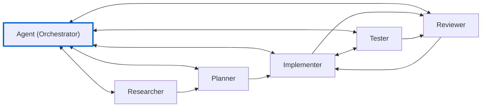

# Agent File Examples

These examples show how to customize the [templates](../templates/agents/) for a **TypeScript/React** project. Adapt them to your own tech stack.

## Workflow

**Why this structure?**
- **Researcher → Planner**: Research informs planning
- **Planner → Implementer**: Plans trigger implementation
- **Implementer ↔ Tester**: Tight loop for TDD and fixing failures
- **Tester → Reviewer**: Tests should be reviewed too
- **Reviewer → Implementer**: Feedback triggers fixes

## Examples

| Agent | Purpose | Tools |
|-------|---------|-------|
| `researcher` | Find patterns and gather context | `search`, `web`, `read` |
| `planner` | Create implementation plans | `search`, `read`, `todo` |
| `implementer` | Write React/TypeScript code | `search`, `edit`, `read` |
| `tester` | Write and run tests | `search`, `edit`, `read`, `execute` |
| `reviewer` | Review code (read-only) | `search`, `read` |

## Tool Reference

- `search` - Search codebase for patterns
- `read` - Read file contents
- `edit` - Modify files
- `execute` - Run terminal commands
- `web` - Fetch external documentation
- `todo` - Track planning tasks

## Further Reading

- [Templates (generalized)](../templates/agents/)
- [VS Code Agents Documentation](https://github.com/m-tuyishime/gh-copilot-templates)
