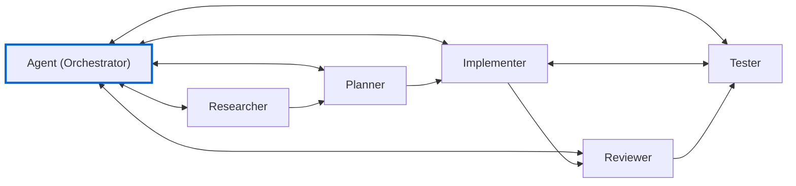

# Agent File Templates

Custom agents are specialized Copilot personas with specific tools, models, and instructions. Store these in `.github/agents/` for workspace-level use or your user profile for global use.

## Workflow: Circular Handoffs

The default `Agent` orchestrates specialized agents. Each can hand back to `Agent` for re-evaluation:



**Key Principle**: Every agent can return to `Agent` for re-evaluation. No forced linear paths.

> **Note**: VS Code will show handoff warnings until you copy these templates to `.github/agents/` in your workspace. This is expected—templates reference each other by name.

## Templates

- `researcher.agent.md` - Research patterns, docs, and context
- `planner.agent.md` - Generate structured implementation plans
- `implementer.agent.md` - Write and modify code
- `tester.agent.md` - Create and run tests
- `reviewer.agent.md` - Critique code without editing

## Design Principle

Think of agents like a dev team with assigned roles:
- **Researcher**: Gathers context, reads docs, finds patterns
- **Planner**: Creates specs, breaks down tasks
- **Implementer**: Writes code, follows specs
- **Tester**: Writes tests, validates behavior
- **Reviewer**: Critiques code, suggests improvements

Each role has clear boundaries. Map those boundaries to tool restrictions and instructions.

## Tool Sets

Common tool configurations:


**Read-only**: `['search', 'web', 'read']`
- Use for: Planning, research, review
- Prevents: Accidental code edits

**Write**: `['edit', 'execute']`
- Use for: Implementation, refactoring
- Allows: Code changes

**Full**: Omit `tools` property
- Use for: General-purpose agents
- Allows: All capabilities

## Handoffs

Chain agents together with handoffs. Example of Researcher -> Implementer handoff:

```yaml
handoffs:
  - label: Start Implementation
    agent: implementer
    prompt: Implement the plan above.
    send: false
```

Set `send: true` for automatic transitions (use cautiously).

## Token Efficiency

Agent files are processed on every request. Avoid markdown that wastes tokens:

- Skip `**bold**` and `_italic_` - LLMs ignore visual formatting
- Use `-` not `- [ ]` for lists
- Be direct, avoid verbose explanations
- One blank line between sections is enough

Long instruction files dilute context. Models follow fewer instructions when overwhelmed.